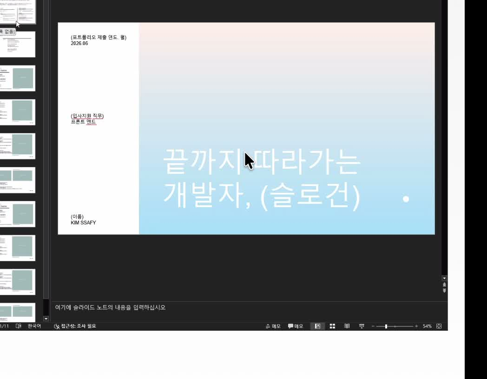
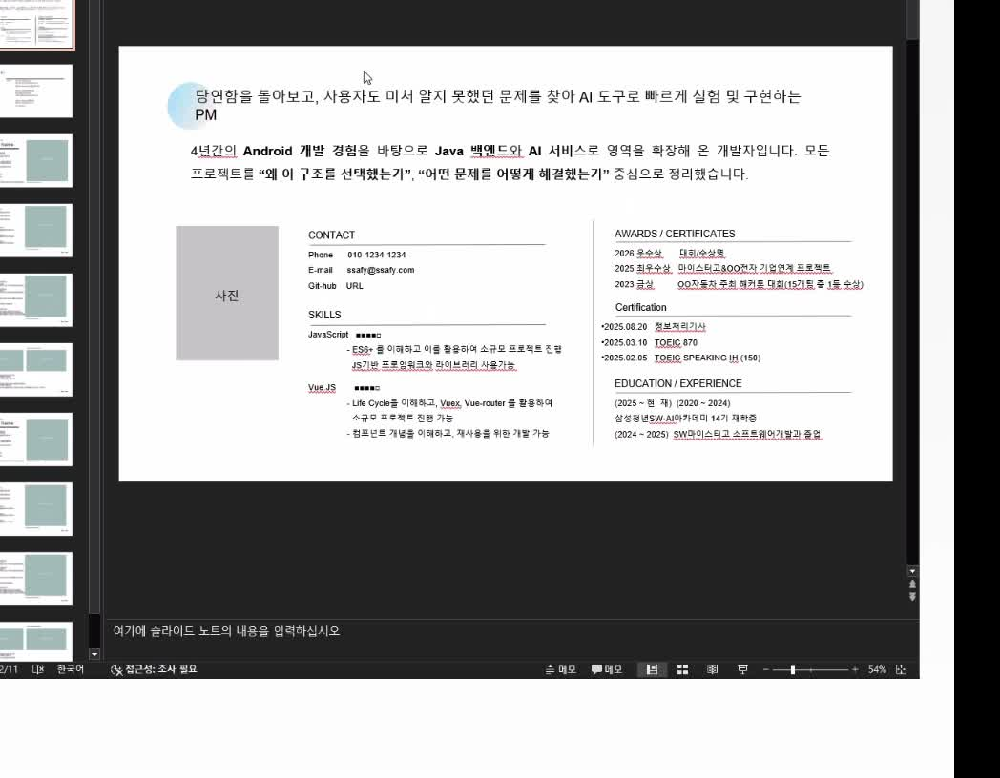
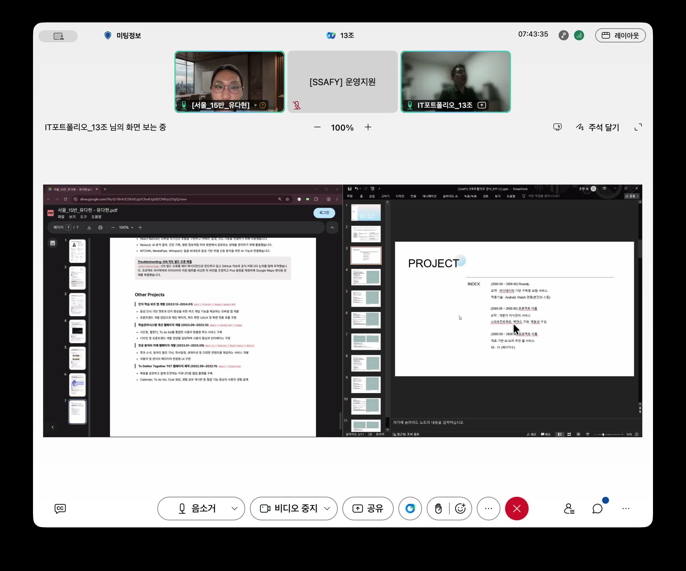
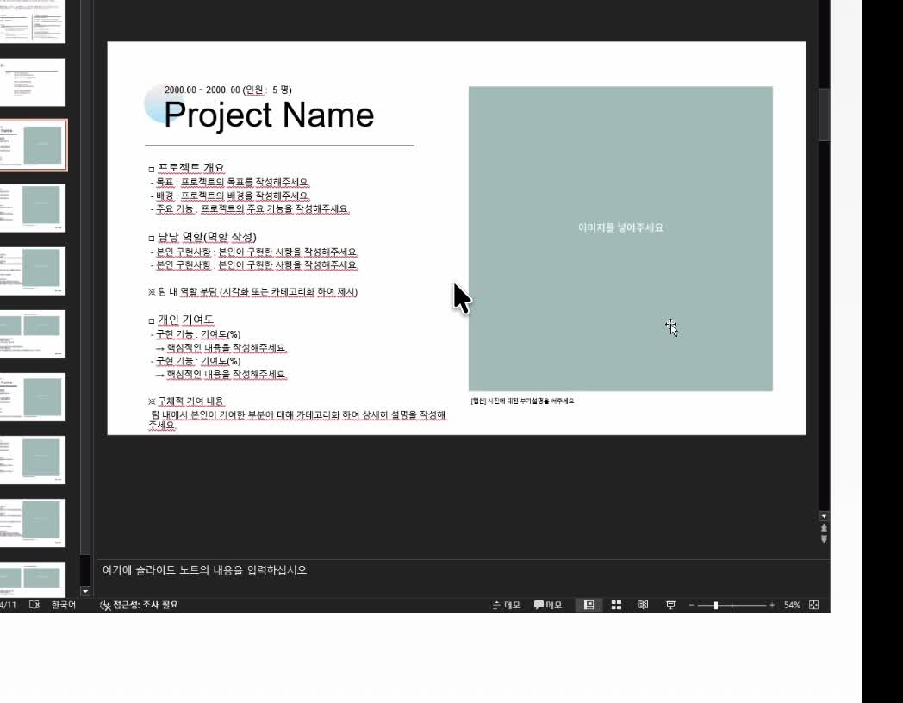
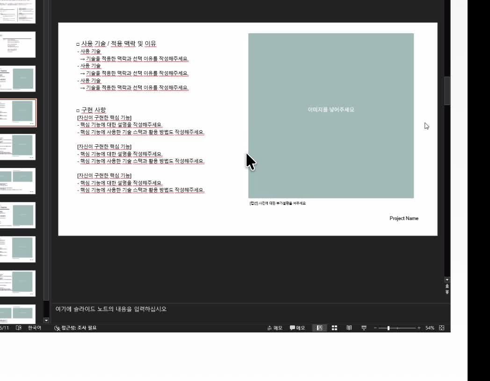

# 포트폴리오 피드백 영상 — 화면 순서·구성 정리

## 정렬 기준

- 원본: `/Users/dahyeon/Desktop/취업박람회/포폴 피드백.mov` (약 52초)
- 아래 순서는 **기존 캡처 파일명**이 아니라 영상에서 실제로 전환되는 슬라이드 순서로 잡았습니다.
- 이전 문서의 `03_프로젝트-목차.jpg`는 목차가 아닌 중복 화면이었습니다. 영상 11초 지점에서 목차를 다시 캡처해 `03_프로젝트-목차-정렬본.jpg`로 저장했습니다.

## 1. 표지

- 왼쪽에는 지원 연도·지원 직무·이름처럼 신원을 빠르게 읽는 정보만 둡니다.
- 오른쪽 큰 영역에는 한 줄 슬로건과 포트폴리오 제목을 둡니다.
- 첫 장의 역할은 프로젝트 설명이 아니라, **어떤 개발자인지 한 문장으로 기억시키는 것**입니다.

## 2. 프로필·핵심 이력 요약

- 상단에는 개발 태도 또는 강점을 짧게 배치합니다.
- 왼쪽에는 사진·연락처·기술 스택, 오른쪽에는 수상·자격·교육 등 검증 가능한 이력을 정리합니다.
- 프로젝트마다 반복하지 않고, **포트폴리오 전체의 신뢰를 만드는 한 장**으로 둡니다.

## 3. 프로젝트 목차

- `PROJECT / INDEX` 아래에 프로젝트명과 해당 페이지를 나열합니다.
- 이 장은 “어떤 프로젝트를 어떤 순서로 보여 줄지”를 안내하는 용도입니다.
- 지금 포트폴리오라면 `Roundy → SAN`처럼 지원 직무와 가장 맞는 순서로 두면 됩니다.

## 4. 프로젝트 소개

- 프로젝트명, 기간, 팀 구성, 한 줄 설명을 먼저 제시합니다.
- 이어서 배경·문제·핵심 기능을 짧게 설명하고, 본인 역할과 개인 기여를 분리합니다.
- 서비스가 무엇인지 바로 이해할 수 있는 대표 화면 또는 구조 이미지를 한 장 배치합니다.

## 5–6. Case 한 장 — 기술·구현 + 성과·회고

- 사용 기술을 나열하는 데서 끝내지 않고, **왜 이 기술을 선택했고 무엇을 구현했는지**를 연결합니다.
- `사용 기술 / 적용 맥락 및 이유 / 구현 사항`처럼 세 칸으로 구분합니다.
- 같은 화면의 하단에는 `프로젝트 성과 및 결과`와 `프로젝트 회고`를 붙입니다.
- 상단에는 결과를 보여 주는 화면·그래프·흐름 이미지를 두고, 하단은 근거가 있는 결과와 다음 판단으로 마무리합니다.
- 성과는 수치·검증 조건·사용자 반응처럼 근거가 있는 결과만 씁니다.
- 회고는 아쉬움 자체보다 다음 구현에서 바꾼 판단이나 운영·협업 관점을 적습니다.

## 화면 구성으로 가져갈 핵심

`표지 → 프로필 → 목차 → 프로젝트 소개 → Case 01·02·03`이 기본 흐름입니다.

- Case 하나는 **상단의 기술·구현 + 하단의 성과·회고**를 한 화면에 묶습니다.
- 프로젝트 한 개 안에서 `소개 1장 → Case 2~3장`으로 읽히게 구성합니다.
- Roundy와 SAN은 각각 현재처럼 사용자 기여가 큰 구현 사례 3개를 사용합니다.

## 기존 캡처 파일 처리

- `04_프로젝트-소개-한장.jpg`와 `08_자기소개-상세.jpg`는 영상 순서와 맞지 않는 중복 캡처라 본문에서 사용하지 않습니다.
- 기존 파일은 보존하고, 목차만 정렬본 파일을 새로 추가했습니다.
